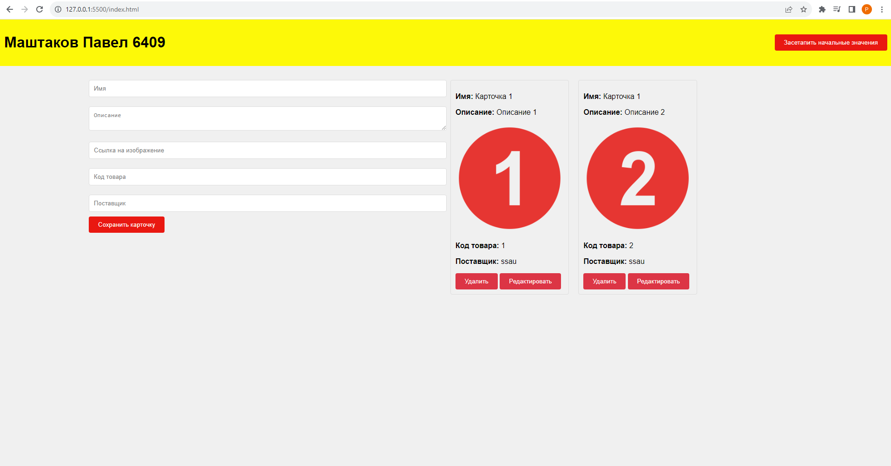
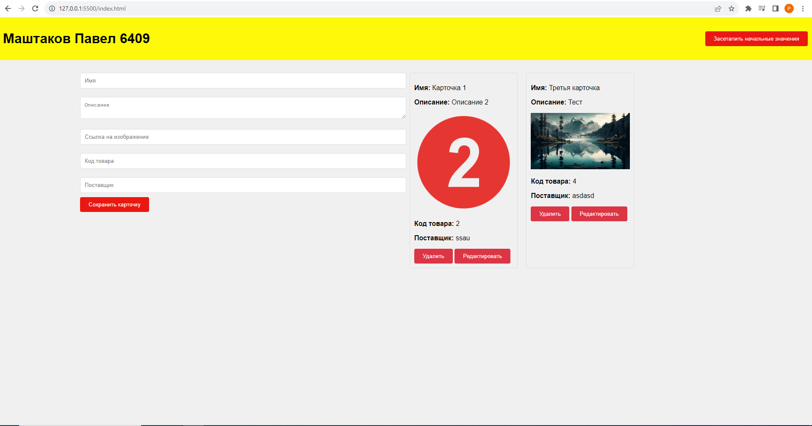
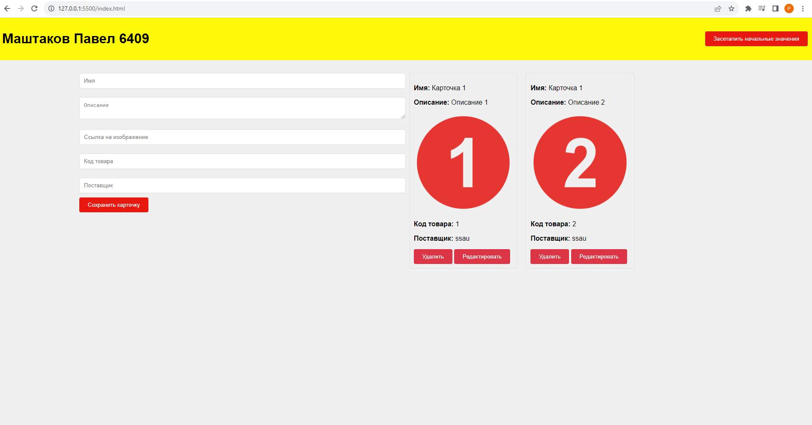
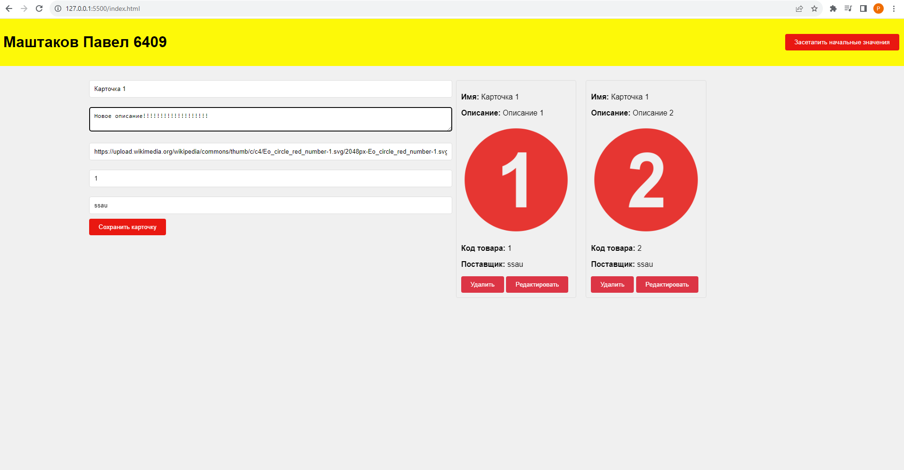
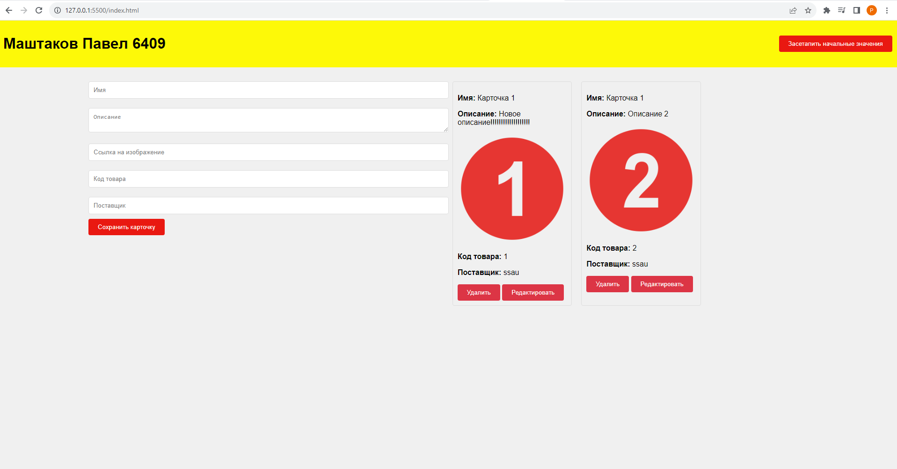
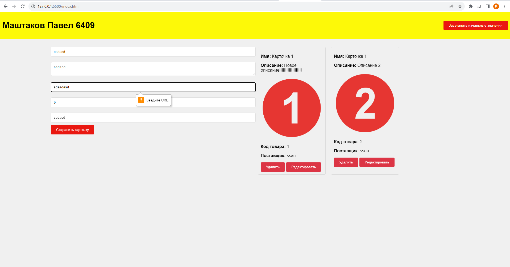

Админка карточек.
Слева представлена форма для добавления и редактирования карточек, которая имеет валидацию, справа - каталог карточек.

Добавим карточку и удалим первую:

Теперь нажмем кнопку в правом верхнем углу и вернем дефолтные карточки, удалив остальные:

Можем отредактировать карточку. После нажатия на кнопку "редактировать" в левую форму подгрузятся данные карточки. (в форме изменено описание)

Теперь сохраним:

А, ну и валидация. Пример на скрине:

